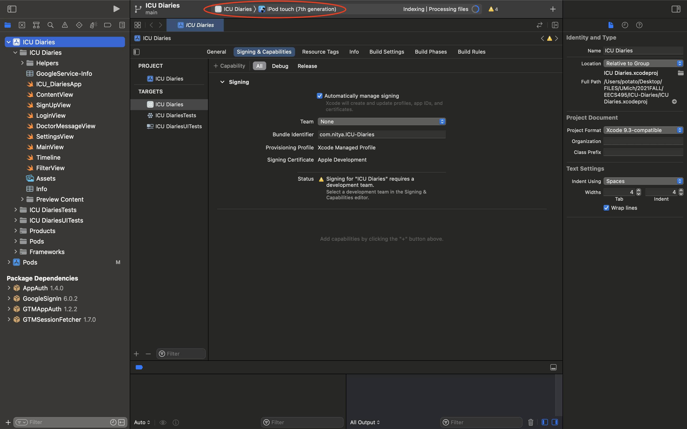
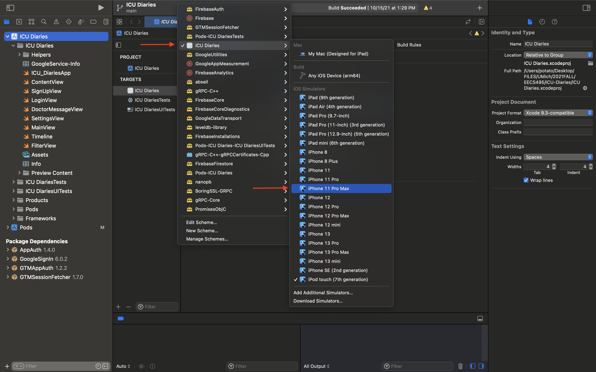

# ICU-Diaries

## Instructions to run our project:

### In Terminal:
- If you do not yet have cocoapods installed on your machine, run the following command in you root directory:

        `sudo gem install cocoapods`

### In this GitHub Repository:
- Go to “Code”
- Select “Open with XCode”

### On XCode (yes, unfortunately you do need XCode to run this):
- First ensure that your XCode version is atleast 9.3 (this is the earliest version our project supports)
- Xcode will prompt you to choose a branch
- Select “main” and hit “clone”
- Choose a location to save it to and hit “clone”
- Wait for packages to load (this should take a minute or so)
- Ensure that the correct scheme ("ICU Diaries") and simulator (any simulator running iOS 14.5+) are selected (see screenshot below)

- If not, click on where it says “ICU Diaries” in the red circle on the screenshot (this may not say ICU Diaries on your machine, but click it anyway) and select the correct scheme ("ICU Diaries") and simulator (any simulator running iOS 14.5+) as shown in the next screenshot

- Next, click the gray play button (directly to the left of where you chose the scheme and simulator) to run the application (or use the shortcut ⌘R)
- Once the simulator is up and running, you should be able to sign-up and then log in to the application.

### Troubleshooting:
- If you get an error like “No such module ’Firebase Auth’”, close the project and open “ICU Diaries.xcworkspace” (not “ICU Diaries.xcodeproj”). Follow the steps again to build and select a simulator
- For any other errors, first try cleaning the build (using the shortcut ⇧⌘K) and then running the application again.
- Additionally, try updating XCode to the msot recent version (13.0)
